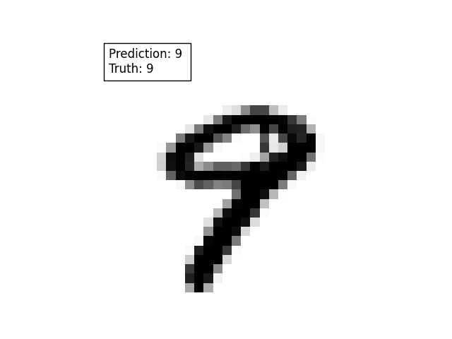

### Dev beats Snakefile demo - AI MNIST

2 lines in the terminal to produce the output:
```console
foo@bar:~$ pip install -r requirements.txt
foo@bar:~$ snakemake --cores 1
```

### Summary of the demo steps

#### Download input data

The MNIST dataset is downloaded and cut to the required size

#### Train CNN

A CNN is trained on the downloaded dataset with Keras:

```python
model = Sequential()
model.add(Conv2D(28, kernel_size=(3,3), input_shape=input_shape))
model.add(MaxPooling2D(pool_size=(2, 2)))
model.add(Flatten())
model.add(Dense(128, activation=tf.nn.relu))
model.add(Dropout(0.2))
model.add(Dense(10, activation=tf.nn.softmax))

# Train model
model.compile(optimizer='adam',
              loss='sparse_categorical_crossentropy',
              metrics=['accuracy'])
model.fit(x=in_dict['x_train'], y=in_dict['y_train'], epochs=10)
```

#### Evaluate trained model

The model that has just been trained is then used
to predict the number in the required image of the test
set:

